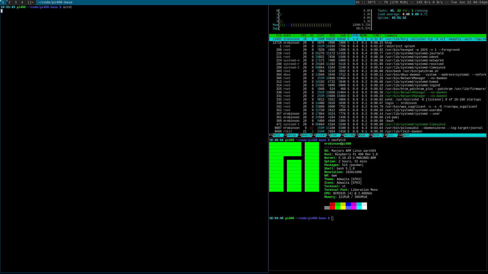

# pi400-base


This repository is a post-installation setup script for [Manjaro
ARM](https://wiki.manjaro.org/index.php/Manjaro-ARM) that installs and
configures my preferred packages to create a minimal desktop environment based
on [dwm.](https://dwm.suckless.org)

## Prerequisites

- You will need a fresh installation of [Manjaro ARM
  Minimal.](https://manjaro.org/downloads/arm/raspberry-pi-4/arm8-raspberry-pi-4-minimal)

- You should be comfortable navigating a terminal and using text editors like
  [Vim](https://wiki.archlinux.org/index.php/Vim) or
  [nano.](https://wiki.archlinux.org/index.php/Nano)

## Installation

On a newly installed Manjaro ARM system clone this repository:

```bash
$ sudo pacman -S git
$ git clone https://github.com/nrobinson2000/pi400-base
$ cd pi400-base
```

Before running `install.sh`, read through the script with your text editor and
verify that you are content with the changes that it will make. To accept the
script, uncomment the `DOTFILES_AGREE="true"` line in `install.sh`.

After accepting, run the script with the following:

```bash
$ ./install.sh
```

The script can take around 10 minutes to complete. After the script finishes,
reboot your system. After logging in, run `startx` to launch dwm.

## Useful shortcuts

Here are some of the keyboard shortcuts I use most often:

### Launchers
- `ALT + P` - Launch dmenu
- `SHIFT + ALT + ENTER` - Launch st

### System
- `SHIFT + ALT + C` - Close a window
- `SHIFT + ALT + Q` - Quit dwm (all running windows will be stopped)

### Window management
- `ALT + J/K` - Move focus through window stack
- `ALT + H/L` - Adjust width of master area
- `ALT + I/D` - Adjust number of windows in master area

### Workspaces/Multi-Monitor
- `ALT + n` - Move focus to workspace `n`
- `SHIFT + ALT + n` - Move window to workspace `n`

**For more shortcuts refer to the `dwm` and `st` man pages.**

## Usage tips (WIP)

Here is some advice for maintaining and using the system:

***TODO***

## Overview

```
OS: Manjaro ARM Linux aarch64 
Host: Raspberry Pi 400 Rev 1.0 
Packages: 513 (pacman) 
Shell: bash 5.1.8 
Resolution: 1920x1080 
WM: dwm 
Theme: Adwaita [GTK3] 
Icons: Adwaita [GTK3] 
Terminal: st
CPU: BCM2835 (4) @ 2.000GHz 
Memory: 222MiB / 3804MiB 
```

## TODO
- Make README more eyecatching
- Document more shortcuts and tips
