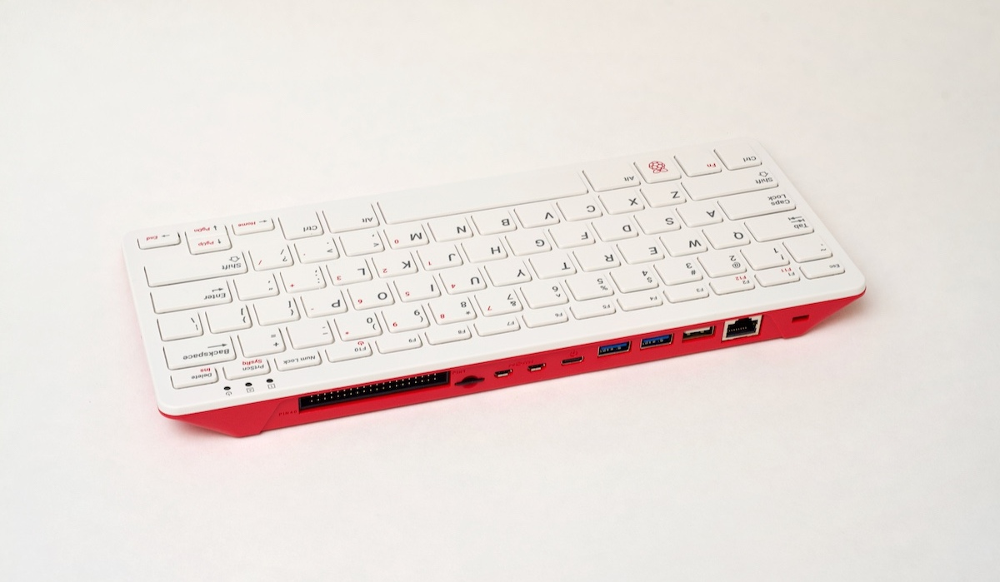
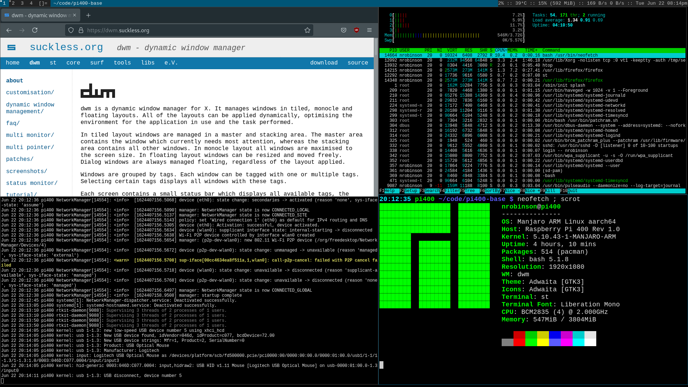

# Introduction


# Introduction


# Introduction

This repository is a post-installation setup configuration for [Manjaro
ARM](https://wiki.manjaro.org/index.php/Manjaro-ARM) that provides  a minimal
desktop environment based on [dwm.](https://dwm.suckless.org)

## Key Features
- Dotfiles for bash, vim, git, conky, xinit
- Lists of packages to replicate my desktop environment
- Manage vim plugins with **vim-plug**

# Why use Manjaro ARM on the Pi 400?

- While there are many Linux distributions available for the Raspberry Pi, few of
them are optimized for productive desktop use.

- The official Raspberry Pi OS is designed for novice users and is still based on
32-bit ARM, lacking support for ARM64 applications.

- I chose Manjaro ARM for this system because it is 64-bit, Arch-based, and
provides a minimal installation image.

- I've found Arch-like distributions to be more useful on the desktop than
Debian-like distributions for many reasons.

# Why use dwm on the Pi 400?

- While there are many editions of Manjaro for the Raspberry Pi featuring desktop
environments like Xfce, KDE, and GNOME, which attempt to make the Pi seem like
a typical Linux desktop, they achieve poor performance due to the lower specs
of the Raspberry Pi.

- Frankly, running a fully-featured desktop environment on a Raspberry Pi is
  counterproductive, since a desktop environment requires a large share of
  resources.

- Because dwm is more efficient and minimalist, you can achieve greater productivity.

# Prerequisites

- You will need a fresh installation of [Manjaro ARM
  Minimal.](https://manjaro.org/downloads/arm/raspberry-pi-4/arm8-raspberry-pi-4-minimal)
  The minimal edition is preferable because there are fewer unnecessary
  packages installed by default.

- You must be comfortable with the terminal and using
  [Vim](https://wiki.archlinux.org/index.php/Vim) since the keybindings in dwm
  are inspired by Vim.

# Installation

On a newly installed Manjaro ARM system clone this repository:

```bash
$ sudo pacman -S git
$ git clone https://github.com/nrobinson2000/pi400-base
$ cd pi400-base
```

Before running `install.sh`, read through the script with your text editor and
verify that you are content with the changes that it will make. To accept the
script, uncomment the `DOTFILES_AGREE="true"` line in `install.sh`.

After accepting, run the script with the following:

```bash
$ ./install.sh
```

The script can take around 10 minutes to complete. After the script finishes,
reboot your system. After logging in, run `startx` to launch dwm.

# Useful shortcuts

## Launchers
- `ALT + P` - Launch dmenu
- `SHIFT + ALT + ENTER` - Launch st

## System
- `SHIFT + ALT + C` - Close a window
- `SHIFT + ALT + Q` - Quit dwm (all running windows will be stopped)

# Useful shortcuts

## Window management
- `ALT + J/K` - Move focus through window stack
- `ALT + H/L` - Adjust width of master area
- `ALT + I/D` - Adjust number of windows in master area

## Workspaces/Multi-Monitor
- `ALT + n` - Move focus to workspace `n`
- `SHIFT + ALT + n` - Move window to workspace `n`

# Useful shortcuts

For more shortcuts, refer to the `dwm` and `st` man pages.

As `dwm` and `st` are highly customizable, you can edit the `config.h` file in
each project to add additional keybindings or change settings.

## dwm
```
$ git clone git://git.suckless.org/dwm
```

## st
```
$ git clone git://git.suckless.org/st
```

# Usage tips (WIP)

Here is some advice for maintaining and using the system:

***TODO***

# Overview

```
OS: Manjaro ARM Linux aarch64 
Host: Raspberry Pi 400 Rev 1.0 
Packages: 513 (pacman) 
Shell: bash 5.1.8 
Resolution: 1920x1080 
WM: dwm 
Theme: Adwaita [GTK3] 
Icons: Adwaita [GTK3] 
Terminal: st
CPU: BCM2835 (4) @ 2.000GHz 
Memory: 222MiB / 3804MiB 
```

# TODO
- Make README more eye-catching
- Document more shortcuts and tips
